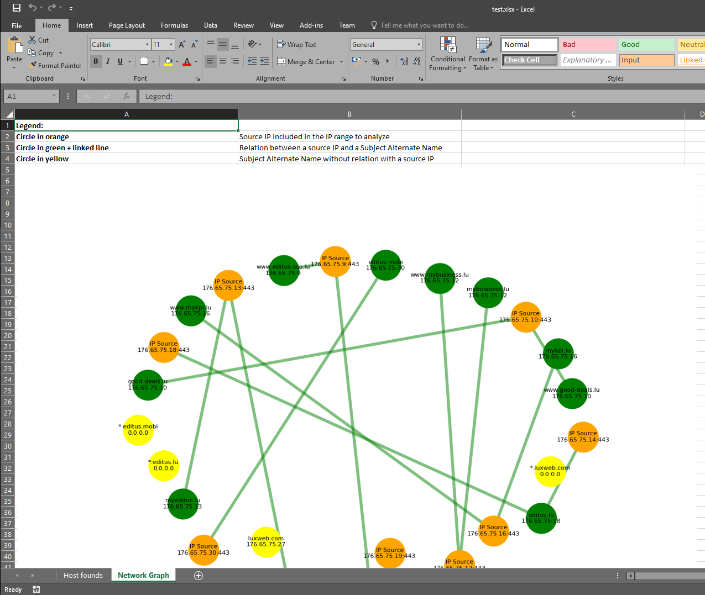

[](https://requires.io/github/righettod/tls-cert-discovery/requirements/?branch=master)

# TLS Certificate Discovery

Tool to identify new host using the ***subjectAltName*** (Subject Alternate Name) extension of a x509 HTTP TLS certificate.

# Motivation

This tool was developed because I have noticed that during the reconnaisance phase of an intrusion test, sometimes, it's possible to find others hosts that belong to the same owner (represented by the intrusion test enquirer) in the HTTP TLS certificate of the web applications. So, I have decided to provide a small tool to identify theses new hosts because they can represents potential new attack surfaces.

# Python version requirement

Python >= 3.5

# Dependencies

Use the following command to install the dependencies packages:

```
pip install -r requirements.txt
```

# How to use it?

Type the following command to obtains the list of parameters:

 ```
python tls_cert_discovery.py --help

usage: tls_cert_discovery.py [-h] [-r IP_RANGE] [-f IP_FILE] [-o RESULT_FILE]

Tool to identify new host using the 'subjectAltName' (SAN) extension of a x509
HTTP TLS certificate.

optional arguments:
  -h, --help      show this help message and exit
  -r IP_RANGE     IP range to analyze in the CDIR format.
  -f IP_FILE      IP range to analyze in which each line of the file contains a IP.
  -o RESULT_FILE  Output file in which result must be stored.
 ```

Type the following command to run the script using an IP range via the CDIR format:

```
python tls_cert_discovery.py -r 176.65.78.0/24 -o test.xlsx
```

Type the following command to run the script using an IP range via the input file:

```
python tls_cert_discovery.py -f ip.txt -o test.xlsx
```

File **ip.txt** have this content:

```
176.65.78.0
176.65.78.1
176.65.78.2
    ...
176.65.78.255
```

# Results

Execution of the tool:


Result are consolidated in a Excel worksheet in which new discovered hosts are highlighted in green. 
The result also include all the SAN founds for each IP on which an HTTP TLS certificate is available on port 443:


Another tab is added in which a network graph is inserted in order to show the relation between source IP(s) and SAN founds.


